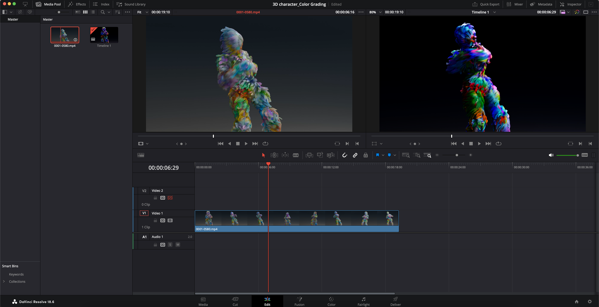
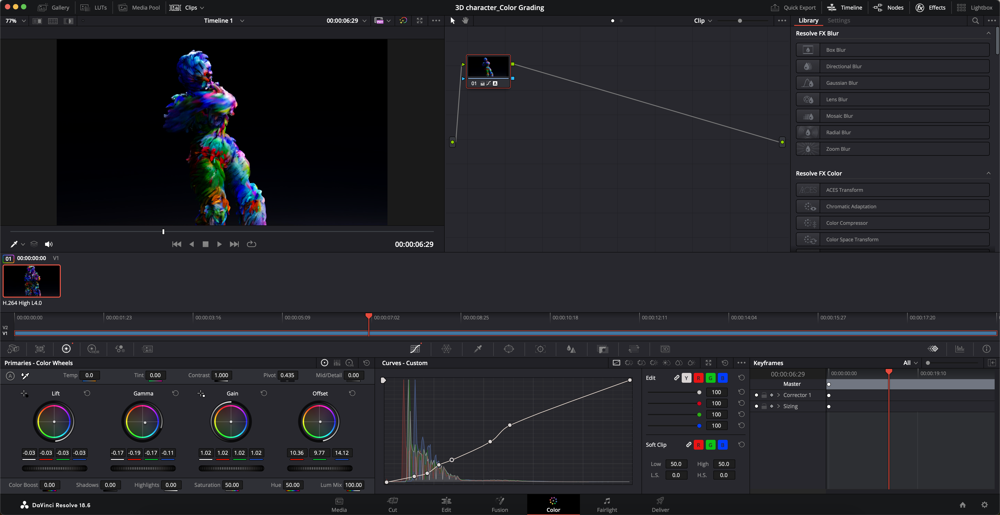

# 3D Character Animation Workflow:
This 3D animation marks my initial attempt. As a beginner in the field of 3D animation, I am undeterred by the challenges. I've chosen to create 3D animated characters to practice and enhance my skills. My goal is to apply these newfound abilities in my visual stories or for future collaborations with clients, companies, or studios.

## First Step

I started by creating movement for my character. As it was my first attempt, I opted to use pre-rigged animated movements of the human body. After some research, I incorporated this animation into **`Blender 3D software`**. Following that, I crafted the background scene and fashioned hair for my character using the particles section.

## Second Step

Lighting plays a crucial role, and for this scene, I utilized a basic lighting setup, as depicted in the picture.

## Third Step

